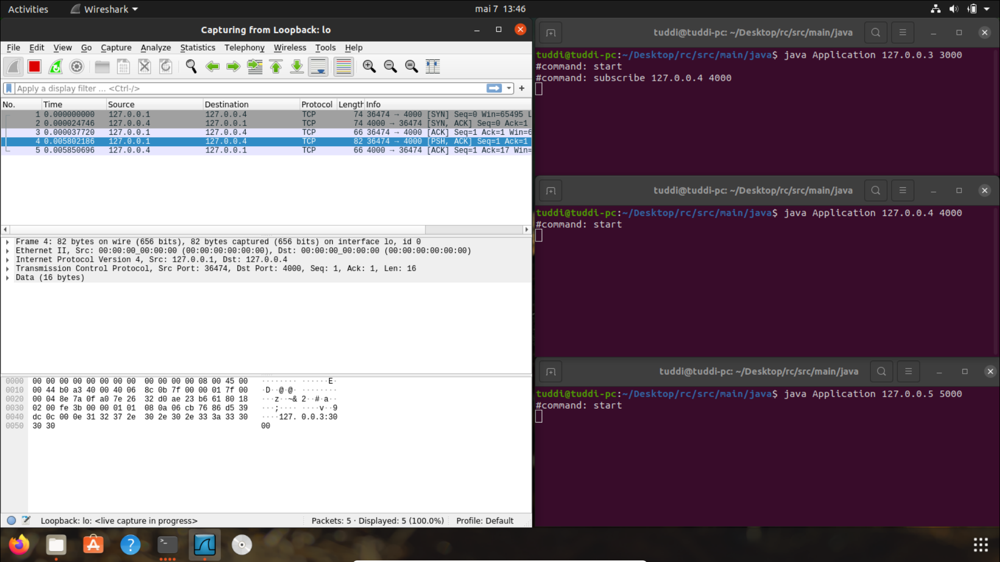
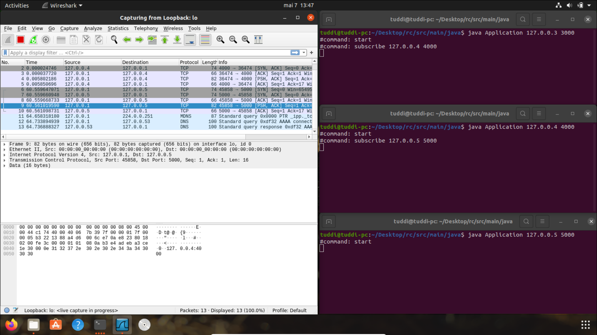
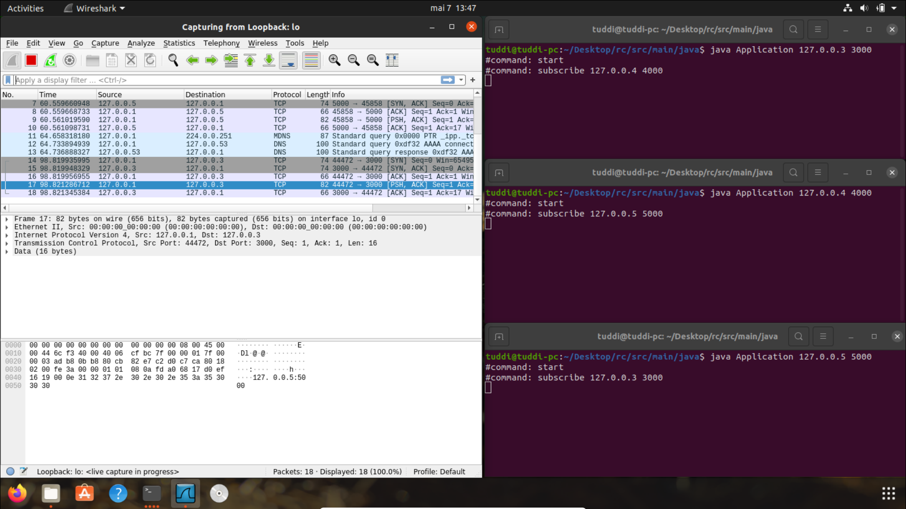
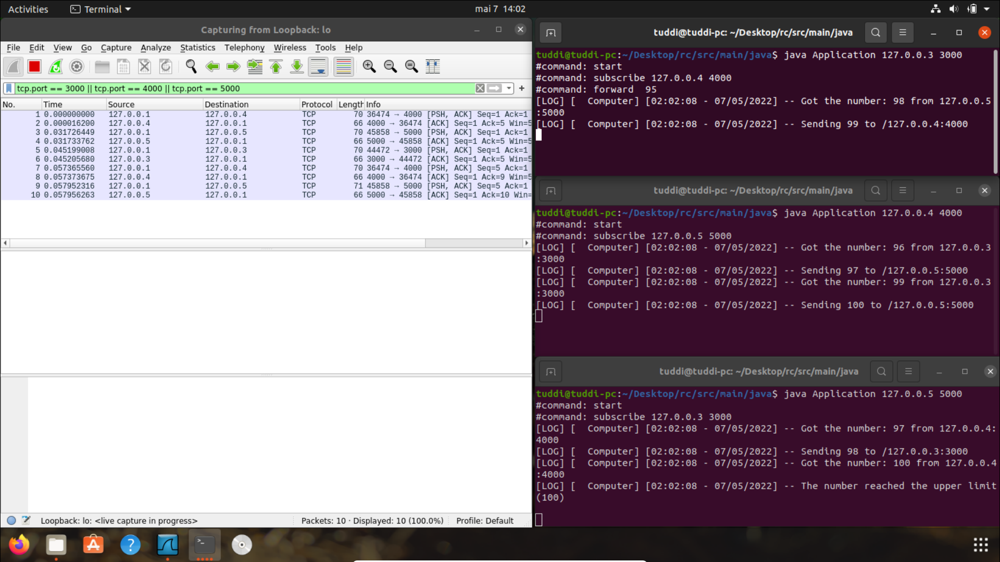
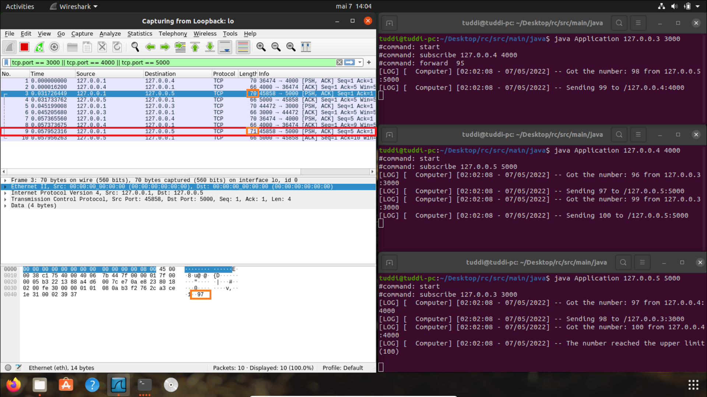
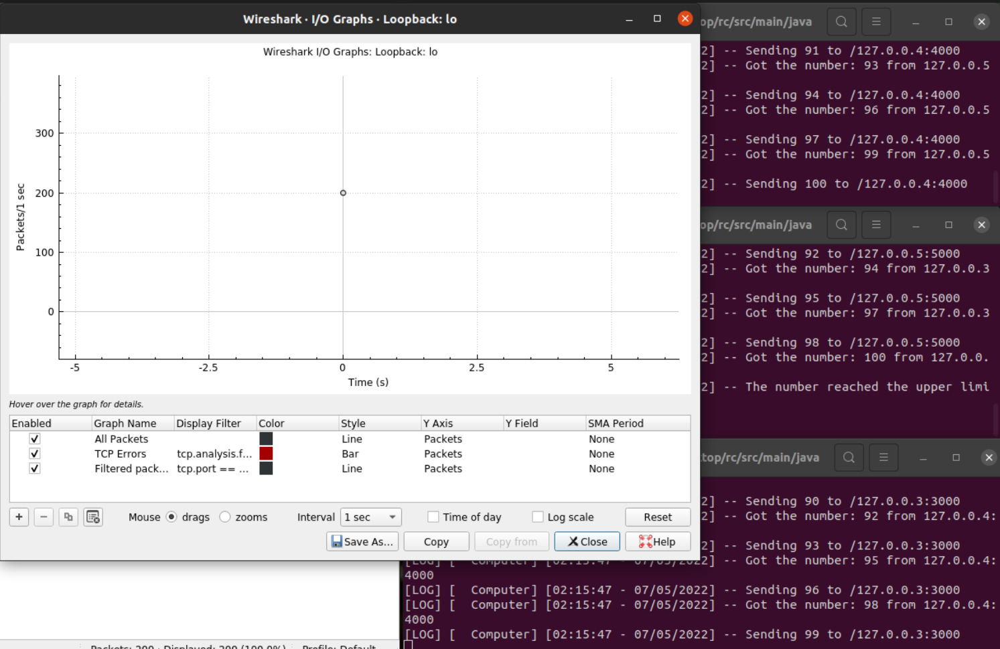
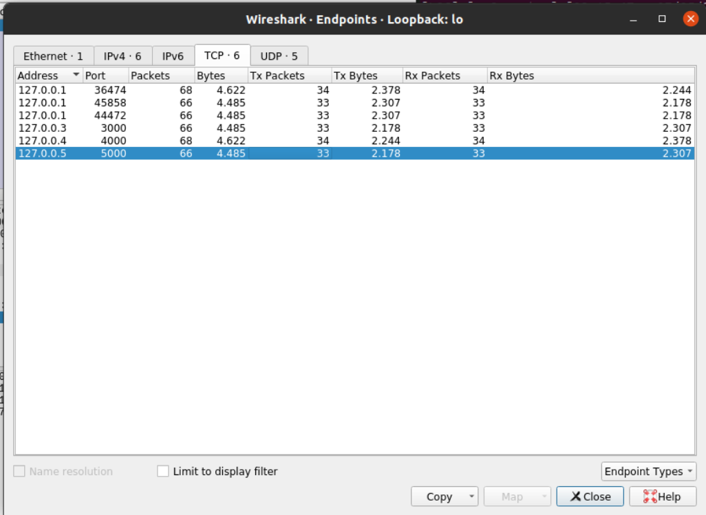
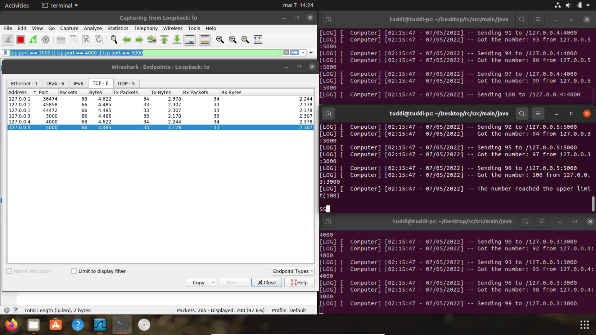
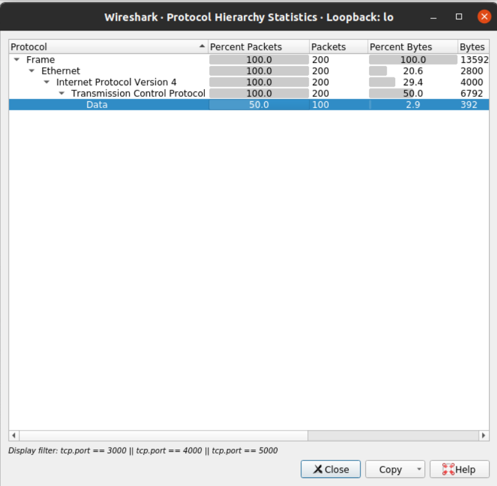

# Proiect RC - Topologie Cerc/Inelara

### Autor: Blidea Tudorel Alexandru, grupa 6, anul III CTI

## Implementarea:

Acest proiect este implementat in Java 8 folosing librariile aferente Socket-urilor (cat si protocolul TCP pentru a fi sigur de faptul ca datele ajung intregi). Am folosit o implementare mai generica, pentru a evita probleme de sincronizare a calculatoarelor, am recurs la o clasa de tipul Computer care accepta comenzi. La pornire trebuie dat host-ul si port-ul unde va lucra instanta creata. Comenzile pentru lucru sunt:

- start
  - Marcheaza inceputul functionarii computerului
- subscribe `host` `port`:
  - Dupa ce computerul la care vrea sa se conecteze a fost pornit, se poate furniza hostul si port-ul pentru a incepe abonarea.
- forward `numar`:
  - Asteapta un numar pe care il va prelua calculatorul curent si il va trimite urmatorului (la care este abonat pentru a incepe rularea)
- kill:
  - termina executia calculatorului curent

## Utilizare

1. Dupa cum putem observa din primele 3 imagini, se vor stabili conexiunile prin 3-way handshake (de accea sunt capturate mai multe pachete de date), ceva ciudat ce am observat este faptul ca datele sunt transmise de la X la 127.0.0.1 (localhost) iar de la 127.0.0.1 catre Y (astfel 127.0.0.1 actioneaza ca un proxy).

Aici se inchide ciclul

2. Din urmatoarele imagini vedem cum se initiaza comunicarea, am trimis pentru inceput un 95 la 127.0.0.3:3000 pentru a incepe comanda de forward. dupa cum putem vedea 127.0.0.3:3000 a trimis un 96 la 127.0.0.4:4000, dupa care 127.0.0.4:4000 trimite un 97 la 127.0.0.5:5000. Am ales sa transmit ca string pentru a fi mai usor vizibil in pachetul de date. Si tot asa pana cand se ajunge la 100 la 127.0.0.5:5000 (Vezi ultimul log din consola).

In imaginea de mai jos, se vede ca pentru inca un caracter (cand se trece la 3 cifre), lungimea pachetului a crescut cu 1.

## Statistici

### In continuare vom observa statisticile din Wireshark legate de pachete. Pentru aceasta am dat comanda `forward 0` (care se va opri cand se va atinge pragul de 100)

1. _I/O graphs_: am dat comanda de `forward 0`, observam un o trecere foarte mare de la 0 la 200 de pachete capturate (deoarece este si proxy-ul la localhost interpus).

2. _Package Length_: Pentru lungimea pachetelor, se vede ca s-au capturat 200 de pachete cu dimensiuni intre 40 si 79, cu o proportie de 98,52%. Media acestor pachete este de 67.96 (deci ar trebui sa ne asteptam) la pachete in jurul lungimii de 68. Cu toate aceastea, lungimea totala a pachetului cade intr-un interval de 55-60 bytes.

3. _Endpoints_: Dupa cum se vede si din fereastra deschisa, initiem cu 0 la 127.0.0.3:3000 si ni se termina la 127.0.0.4:4000. Astfel incat computerele 127.0.0.3:3000 si 127.0.0.5:5000 au primit 33 pachete, iar 127.0.0.4:4000 a primit cu un pachet mai mult (iar acesta nu a plecat mai departe). Si desigur localhostul care s-a comportat ca un proxy intre cele 3 calculatoare.

4. _Hierarchy_: putem observa ca s-au trimis numai 100 pachete de date, dintr-un total de 200, asta inseamna ca localhost-urile (dupa cum s-a vazut pana acum, nu au trimis date, doar au facilitat comunicarea).

5. _Capture File Properties_: Aici se vad mai multe informatii si despre hardware, os, aplicatie, timp, interfete dar si partea de statistici unde putem vedea partea de statistici cu:
   - pachete (213 la numar) dintre care afisate doar 93.9% (deoarece am aplicat un filtru pentru a vedea numai pachetele mele)
   - Average packet size
   - Bytes: cati s-au capturat (aprox 15kB) iar afisati (13.6 kB)
   - Bytes/Biti capturati pe secunda.

## Analiza structurii pachetului

- Putem sa ne uitam intr-un mod mai vizual in wireshark unde se afla (si ce se afla) in pachetul capturat, spre exemplu: in imaginea de mai jos putem observa ca avem un pachet de 4 bytes care se numeste sursa si este de forma `7f 00 00 01` care se traduce prin `127.0.0.1`, urmatorul este `7f 00 00 04` care se trace prin `127.0.0.4`. Exact cum se vede si in partea de sus sub filtru la selectie (la sursa si destinatie).
  
- In imaginea in care analizam `Transmission Control Protocol` putem sa vedem direct in antet datele, dar sa le vizualizam si pe pachetul extras de la sursa la portul destinatie, pe care de asemenea le putem observa in pachtul de date (daca translatam obtinem 0x8e7a = 36474 iar 0x0fa0 = 4000)
  
- Iar in urmatoarea imagine vedem urmatoarele field-uri din pachetul transmis (iar la final, pachetul de date si cu ce se afla acolo, respectiv 3 bytes de informatie " 4").
  
